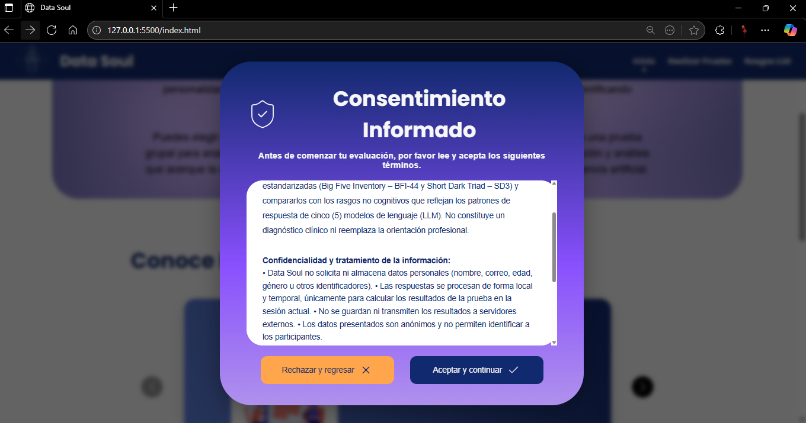
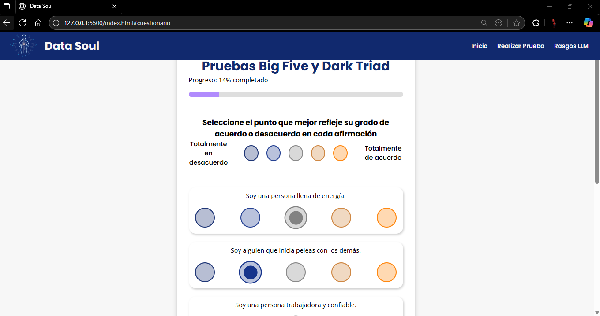
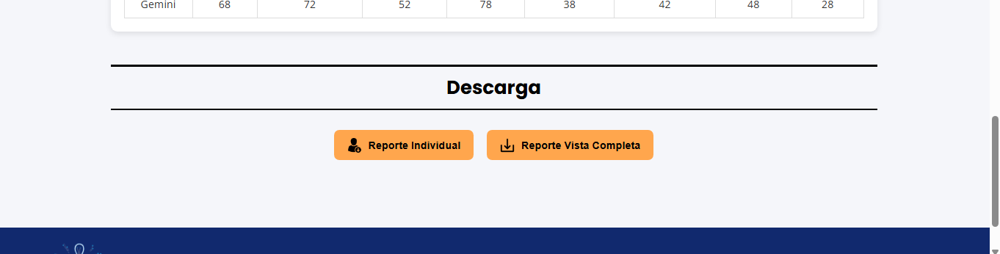
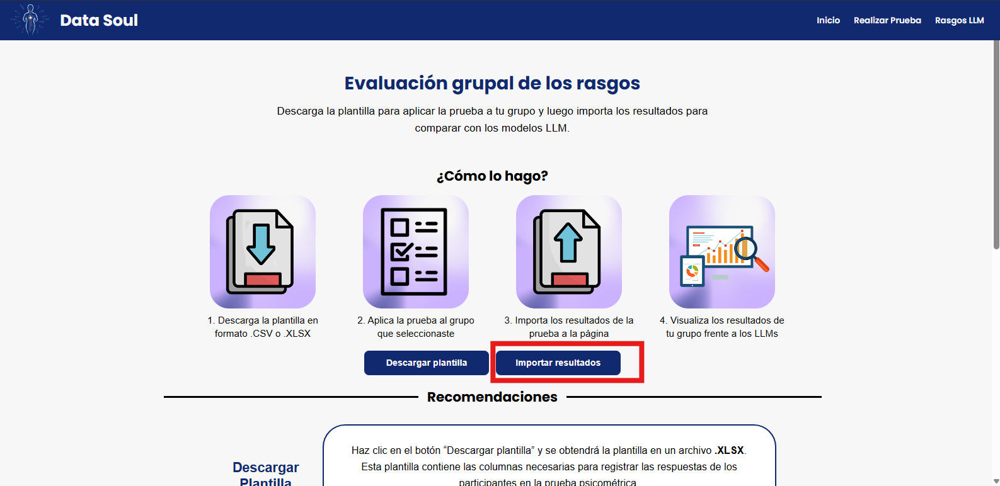

# 03 Manual de usario

## Introducción

Este manual está diseñado para guiar al usuario final del aplicativo Data-Soul, ya sea para la modalidad individual o grupal, sin necesidad de conocimientos técnicos.

## Flujo de uso principal

### Modo Usuario no técnico (Individual):

* Abre el navegador e ingresa al aplicativo

<figure><figcaption></figcaption></figure>

* Elige la opción **“Realizar Prueba”**.

<figure><figcaption></figcaption></figure>

* Elige la opción **“Prueba Individual”.**

<figure><figcaption></figcaption></figure>

* Acepta el aviso de consentimiento informado.

<figure><figcaption></figcaption></figure>

* Responde el cuestionario psicométrico.

<figure><figcaption></figcaption></figure>

* Haz clic en “Terminar” → espera el cálculo automático (aproximadamente 3 segundos).

<figure><figcaption></figcaption></figure>

* Observa el dashboard con gráficos que muestran: tus resultados, los perfiles de los LLM y la similitud.

<figure><figcaption></figcaption></figure> <figure><figcaption></figcaption></figure> <figure><figcaption></figcaption></figure> <figure><figcaption></figcaption></figure>

* Haz clic en “Descargar reporte” para obtener un PDF con tus resultados.

<figure><figcaption></figcaption></figure>

### Modo Investigador (Grupal):

* Abre el navegador e ingresa al aplicativo.

<figure><figcaption></figcaption></figure>

* Elige la opción “Realizar Prueba”.

<figure><figcaption></figcaption></figure>

* Accede a “Prueba Grupal”.

<figure><figcaption></figcaption></figure>

* Descarga la plantilla Excel (.xlsx).

<figure><figcaption></figcaption></figure>

* Recoge respuestas del grupo poblacional.
* Carga el archivo Excel/CSV en la interfaz.

<figure><figcaption></figcaption></figure>

* El sistema procesa los resultados del grupo (hasta \~50 personas, en \~10 segundos).
* Visualiza la comparativa del grupo frente a perfiles de LLM.
* Descarga el reporte grupal en PDF.

## Consejos de uso

* Lee cada pregunta cuidadosamente y responde sin interrupciones.
* No recargues la página mientras respondes.
* Asegúrate de usar un navegador moderno y una conexión estable.
* El archivo de carga grupal debe cumplir la estructura oficial y no superar 5 MB.
* Recuerda que los resultados son **informativos**, no sustituyen una evaluación profesional.

## Interpretación de resultados

* El reporte muestra **8 rasgos no cognitivos** evaluados: los cinco del Big Five (Apertura, Responsabilidad, Extraversión, Amabilidad, Neuroticismo) y los tres de la Dark Triad (Narcisismo, Maquiavelismo, Psicopatía).
* Los resultados se presentan en gráficas (barra o radar) comparando el usuario/grupo con los perfiles de LLM.
* Utiliza estos resultados como herramienta de reflexión y de comparación, no como diagnóstico clínico.

